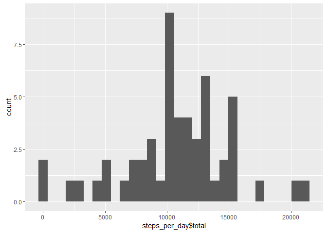
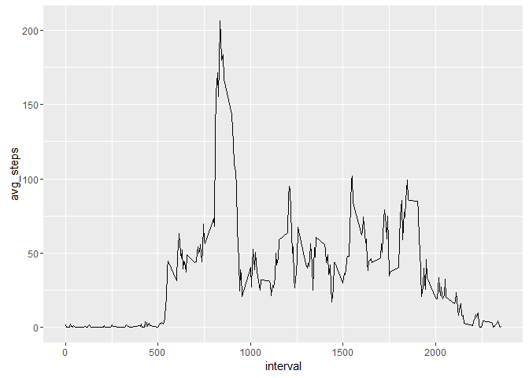
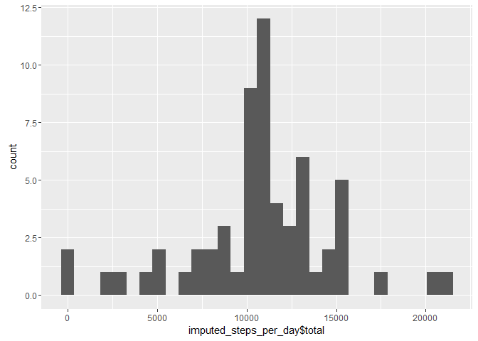
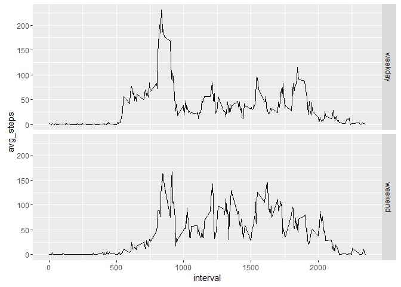

# Reproducible Research: Peer Assessment 1


## Loading and preprocessing the data

```r
activity <- read.csv("activity.csv", stringsAsFactors = FALSE)
```

## What is mean total number of steps taken per day?

```r
library(dplyr)
```

```
## 
## Attaching package: 'dplyr'
```

```
## The following objects are masked from 'package:stats':
## 
##     filter, lag
```

```
## The following objects are masked from 'package:base':
## 
##     intersect, setdiff, setequal, union
```

```r
library(ggplot2)
steps_per_day <- summarise(group_by(activity, date), total = sum(steps))
qplot(steps_per_day$total, geom = "histogram")
```

```
## `stat_bin()` using `bins = 30`. Pick better value with `binwidth`.
```

```
## Warning: Removed 8 rows containing non-finite values (stat_bin).
```

<!-- -->
  
Mean: 1.0766189\times 10^{4}  
Median: 10765   

## What is the average daily activity pattern?

```r
steps_per_interval <- summarise(group_by(activity, interval), avg_steps = mean(steps, na.rm = TRUE))
ggplot(steps_per_interval, aes(interval, avg_steps)) + geom_line() 
```

<!-- -->
  
Interval 835 has the max avg steps of 206.1698113.  
  
## Imputing missing values
Number of rows with NAs: 2304  

```r
avg_interval <- summarise(group_by(activity, interval), avg = mean(steps, na.rm = TRUE))
activity_with_avgs <- left_join(activity, avg_interval, by = c("interval"))
imputed_activity <- mutate(activity_with_avgs, steps = ifelse(is.na(steps), avg, steps))
imputed_activity <- select(imputed_activity, -avg)
imputed_steps_per_day <- summarise(group_by(imputed_activity, date), total = sum(steps))
qplot(imputed_steps_per_day$total, geom = "histogram")
```

```
## `stat_bin()` using `bins = 30`. Pick better value with `binwidth`.
```

<!-- -->
  
Mean: 1.0766189\times 10^{4}  
Median: 1.0766189\times 10^{4}   
The median settles closer to the mean. The histograms look the same but the bin counts are higher.  

## Are there differences in activity patterns between weekdays and weekends?

```r
imputed_activity_weekdays <- mutate(imputed_activity, weekday = ifelse((weekdays(as.Date(date)) == "Saturday" | weekdays(as.Date(date)) == "Sunday"), "weekend", "weekday"))
imputed_activity_weekdays$weekday <- as.factor(imputed_activity_weekdays$weekday)
steps_per_interval_weekday <- summarise(group_by(imputed_activity_weekdays, interval, weekday), avg_steps = mean(steps, na.rm = TRUE))
ggplot(steps_per_interval_weekday, aes(interval, avg_steps)) + geom_line() + facet_grid(weekday ~ .)
```

<!-- -->
